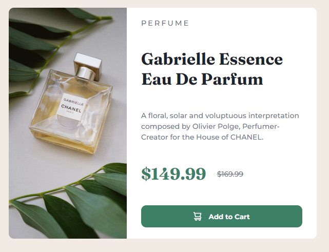

# Frontend Mentor - Product preview card component solution

Yeyyy!!!! My first Frontend Mentor challenge is completed!!!!!
This is a solution to the [Product preview card component challenge on Frontend Mentor](https://www.frontendmentor.io/challenges/product-preview-card-component-GO7UmttRfa). Frontend Mentor challenges help you improve your coding skills by building realistic projects. 

## Table of contents

- [Overview](#overview)
  - [The challenge](#the-challenge)
  - [Screenshot](#screenshot)
  - [Links](#links)
- [My process](#my-process)
  - [Built with](#built-with)
  - [What I learned](#what-i-learned)
  - [Useful resources](#useful-resources)
- [Author](#author)

## Overview

### The challenge

Users should be able to:

- View the optimal layout depending on their device's screen size
- See hover and focus states for interactive elements

### Screenshot



### Links

- Solution URL: [https://www.frontendmentor.io/solutions/responsive-product-preview-card-component-with-html-ans-scss-CEZp-fL2tK]
- Live Site URL: [https://rickhalmoguera.github.io/product_preview-card-component/]

## My process

### Built with

- Semantic HTML5 markup
- SCSS
- Flexbox
- Mobile-first workflow

### What I learned

Although it is a simple project, it helped me to learn the use of ForEach , which I used to change the states of rating buttons

To see how you can add code snippets, see below:

```Js
const checkClick = (ratingClickedId)=>{
    const circles= document.querySelectorAll(".rating-btn")
    circles.forEach(circle => {
        circle.style.backgroundColor ="hsl(213, 19%, 18%)"
        circle.style.color ="hsl(217, 12%, 63%)"
    });
```

### Useful resources

- [JavaScript Array forEach](https://www.w3schools.com/jsref/jsref_foreach.asp) - This helped me to implement the code for the ratings states
- [JavaScript Switch Statement](https://www.w3schools.com/js/js_switch.asp) - How to use this statement

## Author

- Github - [Ricardo Halmoguera](https://github.com/RickHalmoguera)
- Frontend Mentor - [@RickHalmoguera](https://www.frontendmentor.io/profile/RickHalmoguera)


